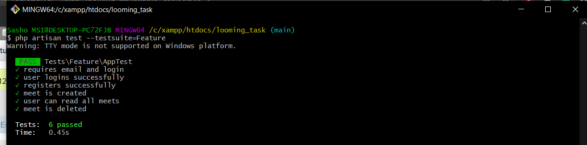

# REST API to serve/edit calendar events

The purpose of this component is to enable web based clients to manage calendar events (aka meetings).

A meeting consists of:
- owner - DONE
- start time - DONE
- end time - DONE
- name - DONE
- meeting room - DONE
- Two meetings can't be placed in the same room at the same time. - DONE
- list all meetings an user (owner) has for a particular day- DONE
- list all meetings an user (owner) has ever had - DONE
- create new meeting - DONE
- add basic authentication
- use Swagger for specification - DONE
- 
- to generate documentation: php artisan l5-swagger:generate to run: http://127.0.0.1:8000/api/documentation
- add update and delete meeting methods - DONE
- Unit test

How to run it?

1. Download and install xampp https://www.apachefriends.org/download.html

2. Install Composer https://getcomposer.org/Composer-Setup.exe

3. Open Git bash or PowerShell

4. Navigate to project directory ex: cd /c//xampp/htdocs/

5. composer global require "laravel/installer=~1.1"

6. git clone git@github.com:sashokrist/event_api_task.git

7. cd laravel-api-task

8. composer install

9. cp .env.example .env

10. php artisan key:generate

11. php artisan migrate

12. php artisan db:seed

13. php artisan serve

Open project on localhost:8000

Unit test -  php artisan test --testsuite=Feature

http://127.0.0.1:8000/api/register  http://127.0.0.1:8000/api/login  http://127.0.0.1:8000/api/meets  http://127.0.0.1:8000/api/meet/1  http://127.0.0.1:8000/api/meet/1  http://127.0.0.1:8000/api/meet/1  http://127.0.0.1:8000/api/meets-user 
